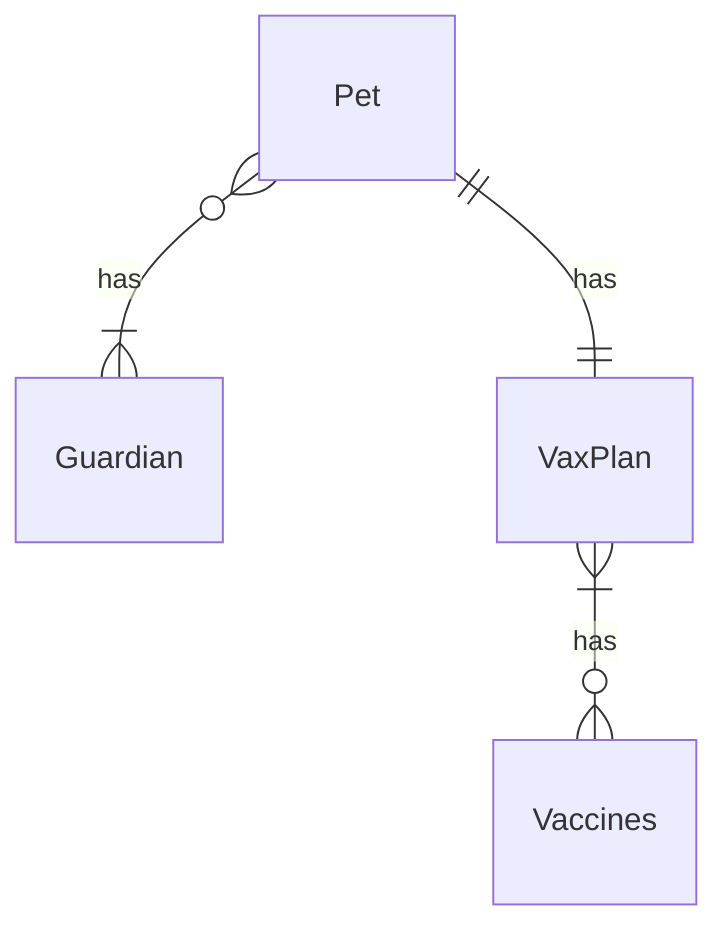

# Pet Service Backend

Welcome to the Pet Service Backend!
This is a simple backend that allows you to manage all of your pets health, so they can grow strong and healthy!

## Motivation

I wanted to actually implement a micro-service architecture in the backend, so why not help my cats Loki and Freyja?
The frontend will also be following a "micro things" architecture (micro-frontend), and will be in a separate repository. Link to the repo will be added as soon as it is ready.

### Architecture

This follows a micro-service architecture, where each service is a micro-service that is responsible for a specific task.

1. Pet.Record.Service - CRUD for Pets
2. Vax.Record.Service - CRUD for Vaccinations' plans' for each Pet
3. Guardian.Record.Service - CRUD for Pet's Guardians
4. Appointment.Record.Service - CRUD for Pet's Appointments
5. Remminder.Record.Service - CRUD for Pet's Reminders

Pet, Vax, Guardian. Record.Service are built on top of a PostgreSQL database.
Appointment, Remminder. Record.Service are built on top of a MongoDB database.

Services talk to each other through RabbitMQ, so each service also keeps a local copy of some data (by consuming event on the queues).

### Database ER Diagram

### Environment

Each service will run on its own port, you can use Postman to interact with each service.
Each service will run on its own docker container.

1. Pet.Record.Service - running on port: 8080
2. Vax.Record.Service - running on port: 8081
3. Guar.Record.Service - running on port: 8082
4. Appointment.Record.Service - running on port: 8083
5. Remminder.Record.Service - running on port: 8084
